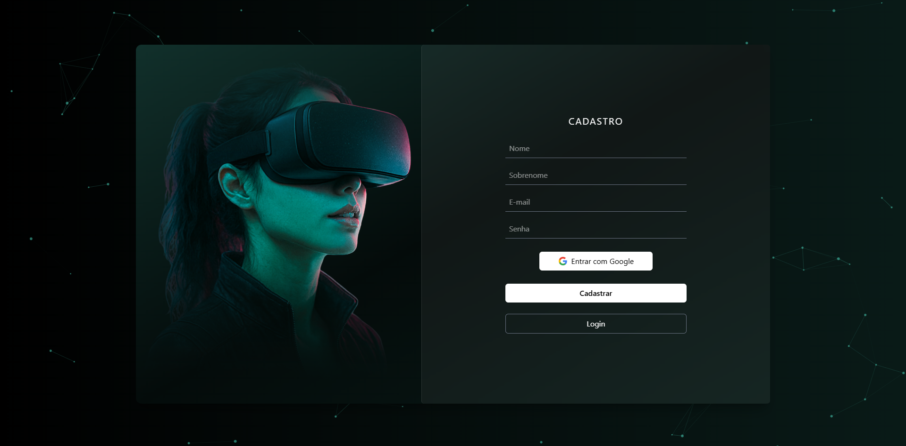

# MagiTech

### Plataforma de Cursos Gamificada com Realidade Virtual

---

## 📌 Sobre o Projeto

O **MagiTech** é uma plataforma de cursos online gamificada, com foco em educação prática, imersiva e de baixo custo de manutenção. Seu principal diferencial é a integração de um **módulo "mão na massa" em Realidade Virtual (VR)**, onde o aluno pratica os conhecimentos em um ambiente virtual gamificado, seguro e interativo.

> Este repositório contém a **versão 2.0** do projeto, uma evolução da versão original desenvolvida como **Trabalho de Conclusão de Curso (TCC) no SENAI**. Esta versão traz melhorias significativas na arquitetura, autenticação e experiência do usuário.

---

## 🧩 Situação-Problema

Identificamos a necessidade de uma **plataforma gamificada, modular e interativa** que ofereça experiências de aprendizagem envolventes, adaptáveis a diferentes contextos educacionais e corporativos.

O principal desafio é **unir engajamento e flexibilidade**, mantendo baixo custo de manutenção e facilidade de expansão. O público-alvo busca:

- Experiências de aprendizagem dinâmicas e com autonomia
- Feedback imediato e variedade de formatos
- Acesso prático sem dependência de laboratórios físicos

A **gamificação e o design imersivo** surgem como formas eficazes de aumentar o engajamento e a retenção do conteúdo.

---

## 🚀 O que há de novo na v2.0

Esta versão é uma reescrita com foco em qualidade de código e experiência completa do usuário:

| Funcionalidade | v1 (TCC SENAI) | v2 (Atual) |
|---|---|---|
| Autenticação | Básica | Login, cadastro, recuperação de senha |
| Banco de Dados | Firebase | MongoDB |
| Backend | — | Express.js + EmailJS |
| Arquitetura | Inicial | Refatorada e modularizada |
| Comentários no código | Poucos | Detalhados em todo o projeto |

---

## 💡 Funcionalidades

- 🔐 Autenticação completa (login, cadastro, esqueci a senha, recuperação por e-mail)
- 🎓 Plataforma de cursos com aulas teóricas online
- 📝 Quizzes interativos para reforço de conteúdo
- 🥽 Módulo prático em **Realidade Virtual** (curso de crimpagem de cabos)
- 🎮 Gamificação do aprendizado
- 📧 Envio de e-mails transacionais via EmailJS
- 🏗️ Arquitetura escalável e modularizada

---

## 🖼️ Preview da Aplicação

### Banner

### Login e Autenticação

### Curso - aula teorica

---

## 🛠️ Tecnologias

### 🌐 Plataforma Web

| Tecnologia | Descrição |
|---|---|
| [React](https://reactjs.org/) | Biblioteca para criação de interfaces dinâmicas e componentizadas |
| [Vite](https://vitejs.dev/) | Ferramenta de build rápida para desenvolvimento moderno |
| [Tailwind CSS](https://tailwindcss.com/) | Framework de estilos utilitários |
| [MongoDB](https://www.mongodb.com/) | Banco de dados NoSQL para armazenamento de usuários e conteúdo |
| [Express.js](https://expressjs.com/) | Framework Node.js para criação das APIs |
| [EmailJS](https://www.emailjs.com/) | Serviço de envio de e-mails (recuperação de senha, notificações) |
| [Firebase](https://firebase.google.com/) | Utilizado na v1 para autenticação e banco de dados |
| [Neon (PostgreSQL)](https://neon.tech/) | Banco de dados serverless usado em módulos da plataforma |
| [GitHub](https://github.com/) | Versionamento e colaboração |

### 🥽 Realidade Virtual

| Tecnologia | Descrição |
|---|---|
| [Unity Engine](https://unity.com/) | Desenvolvimento do ambiente 3D e gamificação em VR |
| C# | Linguagem para scripts de interação e lógica no ambiente VR |
| [Autodesk Maya](https://www.autodesk.com/products/maya/) | Modelagem e animação 3D de todos os assets do projeto |
| Visual Studio | IDE para desenvolvimento e depuração dos scripts Unity |

> 🎨 Todos os modelos 3D foram criados pela própria equipe — nenhum asset externo foi utilizado, garantindo identidade visual exclusiva.

---
## 🎓 Contexto Acadêmico

A **versão original** do MagiTech foi desenvolvida como **Trabalho de Conclusão de Curso (TCC) no SENAI**, representando a consolidação dos conhecimentos técnicos adquiridos ao longo da formação, com foco em inovação, prática e aplicação real de tecnologia educacional.

Esta **v2.0** é uma evolução pessoal do projeto, desenvolvida de forma independente após a conclusão do curso, com o objetivo de aplicar boas práticas de desenvolvimento, melhorar a arquitetura e entregar uma experiência mais completa ao usuário.

---

## 📚 Aprendizados

- Desenvolvimento de plataforma fullstack completa
- Autenticação segura com recuperação de conta
- Integração entre front-end, back-end e Realidade Virtual
- Criação e consumo de APIs REST
- Modelagem e desenvolvimento 3D com assets próprios
- Gamificação aplicada à educação
- Boas práticas de arquitetura e organização de código

---

## 👥 Equipe

Desenvolvido com 💚 pela equipe MagiTech — SENAI TCC

---

  MagiTech v2.0 — Feito com React, Vite e muita determinação 🚀

